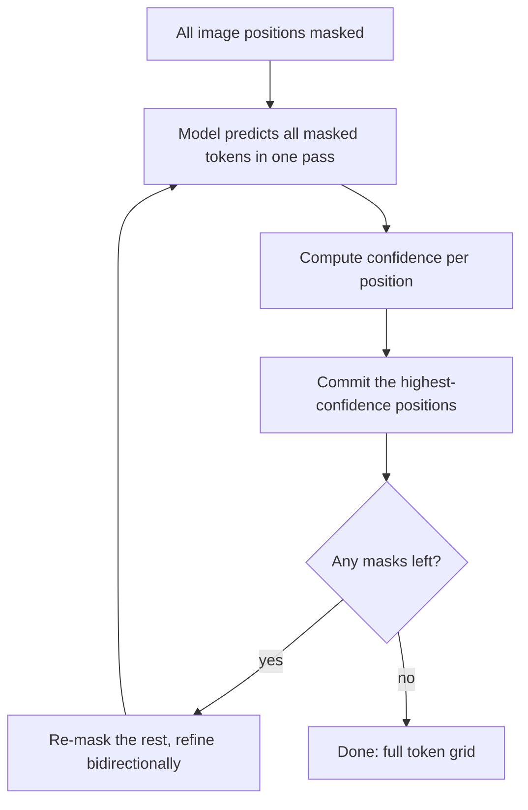
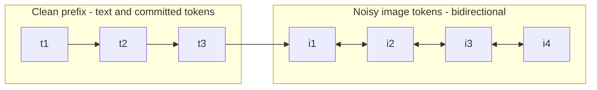
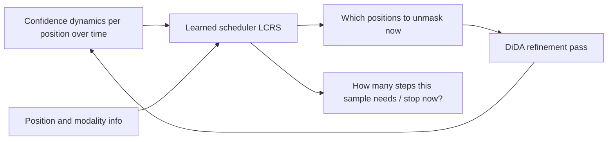

# Extended Introduction: DiDA for Everyone

This is the **zero-background** version. If words like "transformer,"
"autoregressive," or "diffusion" are new to you, start here. We build the
whole picture with one extended analogy — painting a picture — plus a few
diagrams and one-sentence math explanations with links to friendly tutorials.

## 1. The painting analogy

Imagine asking an artist to paint a picture made of a grid of tiny colored
squares.

**Autoregressive (AR) painting** = coloring **one square at a time, strictly
left to right, top to bottom**, like a typewriter. The artist never moves on
until the current square is final. This is how models like Emu3 [2] generate
images today: one token, then the next, then the next. For a 32×32 grid that
is 1,024 separate decisions — each waiting on the last. Careful, but slow.

**Diffusion painting** = **sketch the whole canvas at once** (a blurry, noisy
guess covering every square), then refine the entire canvas again and again.
Each pass touches every square simultaneously. Instead of 1,024 sequential
steps, you might need 10–20 full-canvas refinements. That is the core trick of
discrete diffusion [3, 4].

**Confidence unmasking** = after each refinement pass, **commit first to the
strokes you're most sure of**. The artist looks at the whole canvas, finalizes
the squares they feel confident about, and keeps reworking the uncertain ones.
Easy regions (a flat sky) get finished early; hard regions (a face) get more
passes. This is MaskGIT's idea [4], and DiDA inherits it.

**DiDA itself** (from Emu3.5 [1]) = taking an artist who was *trained* to
paint left-to-right and teaching them this new whole-canvas technique —
without retraining them from scratch. You change the rules they work under
(how they're allowed to look at the canvas) and give them a short
apprenticeship where they copy their own old paintings (self-distillation).
The result, per the paper: about **20× faster** painting, same quality, and
their handwriting (text generation) is completely untouched.

## 2. The key ideas, one at a time

### Tokens: images as words

Computers don't store pictures as pixels inside these models; they chop an
image into a grid of small patches and assign each patch a "word" from a
fixed visual dictionary (a VQ codebook). Generating an image then becomes
generating a sequence of words — which transformers are great at.

### Masking: the "noise" in discrete diffusion

Instead of adding blurry pixel noise (as in photo diffusion), discrete
diffusion uses a simpler kind of noise: **replace some tokens with a special
`[MASK]` placeholder**. At the start of generation, *every* image position is
masked. The model's job is to fill them in.

> **Masking probability, in one sentence:** "Each token is independently
> hidden with some probability that grows as we go from clean data to full
> noise." (Friendly primer on probability:
> [Khan Academy – Probability](https://www.khanacademy.org/math/statistics-probability/probability-library))

### Schedules: how much to unmask at each step

A **schedule** decides, at every refinement pass, how many positions to keep
masked versus commit. A common choice is the **cosine schedule** [4]: start
cautiously, commit more aggressively in the middle, finish the last few
carefully.

> **Cosine schedule, in one sentence:** "The fraction of tokens still masked
> follows the smooth curve of cos(t), so unmasking starts slow, speeds up,
> then slows again." (Cosine refresher:
> [Khan Academy – Trigonometry](https://www.khanacademy.org/math/trigonometry))

### Confidence: deciding what to commit

After each pass, the model outputs, for every masked position, a full guess
plus a **confidence score** (how sure it is). We finalize the
highest-confidence positions and re-mask the rest.

> **Confidence, in one sentence:** "The model's predicted probability for its
> top guess at a position — a number between 0 and 1 saying how certain it
> is." (Softmax/probability intuition:
> [StatQuest – Softmax](https://www.youtube.com/results?search_query=statquest+softmax))

### Training: teaching the model to fill blanks

> **Cross-entropy loss, in one sentence:** "A scoring rule that heavily
> penalizes the model when it assigns low probability to the correct token —
> the standard way to train models that pick one option out of many."
> ([StatQuest – Cross Entropy](https://www.youtube.com/results?search_query=statquest+cross+entropy);
> see also [3Blue1Brown – Neural Networks](https://www.3blue1brown.com/topics/neural-networks)
> for how such models learn.)

## 3. How DiDA decoding flows

Contrast with AR: that loop would be a straight line of 256–1,024 single
steps. Here the loop runs a small, fixed number of times (e.g., 10), and each
pass handles *all* positions at once [1, 4].

## 4. The hybrid attention mask: who is allowed to look at whom

Attention rules decide which tokens may "see" which other tokens. AR models
use a **causal** rule: a token may only look left (to the past). DiDA keeps
that rule for *clean* tokens (the text prompt, already-finished regions) but
lets *noisy image tokens* look in **all directions** at each other — because a
half-finished painting region benefits from seeing the whole region, not just
its left half [1].

"Mask surgery" means rewiring exactly these looking-rules inside a pretrained
AR model, then briefly fine-tuning it so its new parallel predictions match
what its old left-to-right self would have produced (self-distillation) [1].

## 5. Where the field stands

- **Foundations:** D3PM [3] introduced discrete diffusion; MaskGIT [4]
  introduced confident parallel unmasking for images; SEDD [5] and MDLM [6]
  made masked diffusion competitive for text; LLaDA [8] scaled it to 8B
  parameters.
- **Adapting AR models instead of starting over:** DiffuLLaMA [10] and Dream
  7B [9] convert pretrained AR language models into diffusion decoders;
  Dream-Coder 7B [14] does it for code; DiDA [1] does it for image tokens
  inside a multimodal model.
- **Faster sampling without retraining:** Fast-dLLM [11] unmasks in parallel
  whenever confidence passes a threshold; ReMDM [12] rethinks the remasking
  step itself.
- **The competitor:** speculative decoding [13] speeds up AR models by
  drafting-and-verifying, without changing the decoding order.

## 6. The novel idea this repo is building toward: LCRS

Every published sampler above decides *when to unmask* with a **hand-written
heuristic** — a fixed cosine curve [4], a fixed confidence threshold [11], or
a fixed schedule [12]. RL add-ons exist (MDPO [16]) but are bolted on after
the fact. The **LCRS (Learned Confidence Remasking Scheduler)** vision is to
replace the heuristic with a **small learned scheduler**: a tiny model that
watches how confidences evolve and decides, per sample, what to unmask next
and when to stop — trained by imitating near-optimal "oracle" decisions on
synthetic tasks. Easy samples get few passes; hard samples get more.

That is the research direction of this repository's roadmap
(`docs/ROADMAP.md`); the current codebase implements the DiDA mechanics such a
scheduler would plug into.

## 7. Keeping expectations honest

This repo runs on **synthetic** image-token grids with tiny models. It
demonstrates and tests the *mechanics* — masking, schedules, hybrid attention,
parallel sampling — not real images or real speedups. The 20× number comes
from the Emu3.5 paper [1]. Think of this codebase as a flight simulator: the
instruments are real, the runway is not.

## References

1. Cui, Y., Chen, H., Deng, H., et al. (BAAI), 2025. *Emu3.5: Native Multimodal Models are World Learners*. arXiv:2510.26583.
2. Wang, X., et al. (BAAI), 2024. *Emu3: Next-Token Prediction is All You Need*. arXiv:2409.18869.
3. Austin, J., et al., NeurIPS 2021. *Structured Denoising Diffusion Models in Discrete State-Spaces* (D3PM). arXiv:2107.03006.
4. Chang, H., et al., CVPR 2022. *MaskGIT: Masked Generative Image Transformer*. arXiv:2202.04200.
5. Lou, A., Meng, C., Ermon, S., ICML 2024. *Discrete Diffusion Modeling by Estimating the Ratios of the Data Distribution* (SEDD). arXiv:2310.16834.
6. Sahoo, S., et al., NeurIPS 2024. *Simple and Effective Masked Diffusion Language Models* (MDLM). arXiv:2406.07524.
7. Li, X. L., et al., NeurIPS 2022. *Diffusion-LM Improves Controllable Text Generation*. arXiv:2205.14217.
8. Nie, S., et al., 2025. *Large Language Diffusion Models* (LLaDA). arXiv:2502.09992.
9. Ye, J., et al., 2025. *Dream 7B*. arXiv:2508.15487.
10. Gong, S., et al., 2024. *Scaling Diffusion Language Models via Adaptation from Autoregressive Models* (DiffuLLaMA). arXiv:2410.17891.
11. Wu, C., et al., 2025. *Fast-dLLM: Training-free Acceleration of Diffusion LLM by Enabling KV Cache and Parallel Decoding*. arXiv:2505.22618.
12. Wang, J., Schiff, Y., Sahoo, S., Kuleshov, V., 2025. *Remasking Discrete Diffusion Models with Inference-Time Scaling* (ReMDM). arXiv:2503.00307.
13. Leviathan, Y., Kalman, M., Matias, Y., ICML 2023. *Fast Inference from Transformers via Speculative Decoding*. arXiv:2211.17192.
14. Dream-Coder 7B, 2025. arXiv:2509.01142.
15. Yang, D., et al., IEEE/ACM TASLP 2023. *DiffSound: Discrete Diffusion Model for Text-to-Sound Generation*. arXiv:2207.09983.
16. MDPO, 2025. *Masked Diffusion Policy Optimization* (RL remasking). arXiv:2508.13148.
17. *Path Planning for Masked Diffusion Sampling*, 2025. arXiv:2502.03540.
18. *Think While You Generate*, 2024. arXiv:2410.06264.
