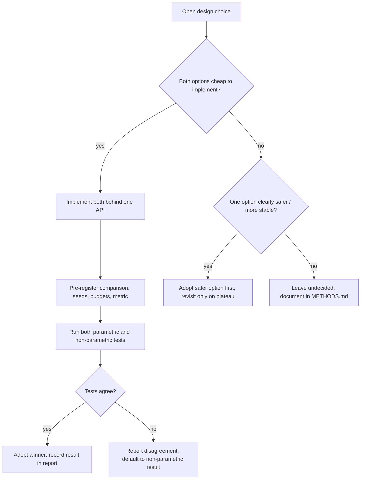

# Methods: What Is Done, What Is Intended, and What Is Undecided

This document separates three things that are often blurred in educational
repos: (1) what the code **actually does today**, (2) what is **planned** and
why, and (3) design choices we have **deliberately left open**, with both
options and the rule we will use to decide.

## Done

All of the following is implemented and covered by the 18 passing tests in
`tests/test_dida.py`:

- **DiDA core denoising model** — `dida/core.py`, `DiDACore`: a small
  PyTorch transformer that predicts all masked image tokens in a single
  forward pass.
- **Discrete diffusion scheduler** — `dida/core.py`,
  `DiscreteDiffusionScheduler`: noise schedule controlling how many positions
  are masked/unmasked at each step of the forward (masking) and reverse
  (denoising) processes.
- **Hybrid attention masks** — `dida/core.py`, `DiDAAttentionMask`:
  bidirectional attention among noisy image tokens, causal attention for
  clean text/committed tokens, matching the DiDA mask-surgery design from
  Emu3.5 [1].
- **Sampling pipeline** — `dida/sampler.py`, `DiDASampler` and
  `DiDAInference`: full masked-diffusion decoding loops for pure image
  generation and interleaved text-to-image generation.
- **Test suite** — `tests/test_dida.py`: 18 unit and integration tests on
  synthetic data (mask correctness, scheduler behavior, sampling shapes and
  determinism). All pass.
- **Docs** — `docs/ARCHITECTURE.md` (architecture deep dive),
  `docs/TESTING.md` (testing methodology), `docs/INTRODUCTION.md` and
  `docs/EXTENDED_INTRODUCTION.md` (onboarding).

## Intended

Planned work, tracked as issues and summarized in `docs/ROADMAP.md` and
`docs/PROJECT.md`:

1. **Remasking baselines behind one scheduler API** — MaskGIT-style cosine
   schedule [4] and Fast-dLLM-style confidence thresholding [11], selectable
   via one interface.
   *Rationale:* any learned scheduler must beat honest baselines, not a straw
   man. *Failure mode:* a single hand-rolled baseline is easy to accidentally
   weaken, inflating apparent gains.
2. **Speed/quality Pareto harness** — forward-pass count vs synthetic-task
   quality, with fixed seeds and pre-registered metrics.
   *Rationale:* the headline DiDA claim is a speed/quality trade [1]; without
   a harness we cannot test it. *Failure mode:* unseeded runs and cherry-picked
   step counts produce irreproducible comparisons.
3. **Synthetic text modality leg** — arithmetic-carry and bracket-matching
   tasks with the same hybrid-mask adaptation, compared against a causal AR
   baseline. *Rationale:* tests whether the adaptation mechanics are
   modality-general. *Scope note:* DiDA-for-text exists in the literature
   (DiffuLLaMA [10], Dream [9], Dream-Coder [14]); this is educational
   reproduction, not a novelty claim. *Failure mode:* hybrid-mask bugs
   silently degrade causal quality — masks must be unit-tested against a
   reference causal run.
4. **LCRS: Learned Confidence Remasking Scheduler** — a small learned
   scheduler mapping confidence dynamics to unmask/stop decisions, distilled
   from oracle trajectories. See `docs/ROADMAP.md` Phase 3.
   *Rationale:* all published samplers use heuristic schedules [4, 11, 12] or
   RL bolt-ons [16]; a small distilled scheduler is an unclaimed gap.
   *Failure mode:* the learned scheduler collapses to imitating a Fast-dLLM
   threshold, adding complexity without gain — the baselines in item 1 exist
   precisely to catch this.

## Undecided choices

For each open choice we record **both** options and the **selection rule**,
so the decision is made on evidence rather than taste.

### 4.1 Remasking baseline

- **Option A — MaskGIT cosine schedule [4]:** the number of positions unmasked
  per step follows a cosine curve; simple, canonical, widely reproduced.
- **Option B — Fast-dLLM confidence threshold [11]:** unmask every position
  whose confidence exceeds a fixed threshold, in parallel; adaptive per sample
  without training.
- **Selection rule:** **implement both**, pre-register the comparison (fixed
  seeds, fixed step-budget grid, quality metric from 4.2), and treat both as
  reference baselines in every subsequent experiment. There is no "pick one"
  decision; the choice is only which to headline, and that follows the
  pre-registered report.

### 4.2 Quality metric on synthetic tasks

- **Option A — exact-match accuracy:** fraction of generated grids/sequences
  exactly equal to the ground-truth pattern. Right when tasks have a single
  correct answer (arithmetic, bracket matching).
- **Option B — distributional distance:** divergence between the model's
  output distribution and the task's valid-output distribution (e.g., total
  variation over pattern statistics). Right when many outputs are valid
  (procedural textures) and mode collapse is the risk.
- **Selection rule:** report **both**; headline exact-match on tasks with
  unique answers and distributional distance on multi-answer tasks. If the two
  metrics ever disagree on a conclusion, report the disagreement rather than
  resolving it post hoc.

### 4.3 Scheduler training (for LCRS)

- **Option A — distillation from oracle orders:** generate near-optimal
  unmask orders by greedy per-step search on synthetic tasks, then train the
  scheduler to imitate them (supervised).
- **Option B — reinforcement learning:** train the scheduler directly against
  a speed/quality reward (as in MDPO [16]).
- **Selection rule:** **distillation first.** Oracles are cheap on synthetic
  tasks, supervised training is stable and debuggable, and the distilled
  policy gives a clean initialization. RL is only reconsidered if distilled
  performance plateaus *and* the oracle itself provably beats the heuristic
  baselines; otherwise RL would be optimizing noise.

### 4.4 Statistical tests for speedup/quality comparisons

- **Option A — parametric tests** (e.g., paired t-test across seeds): more
  statistical power when differences are roughly normally distributed.
- **Option B — non-parametric tests** (e.g., Wilcoxon signed-rank,
  bootstrap confidence intervals): fewer assumptions, robust with few seeds
  or skewed distributions.
- **Selection rule:** run **both**; trust the non-parametric result by default
  (few seeds expected), and only headline the parametric result when a
  normality check (e.g., Shapiro–Wilk) passes and both tests agree. Report
  effect sizes alongside p-values in all cases.

## Decision flowchart

## References

1. Cui, Y., Chen, H., Deng, H., et al. (BAAI), 2025. *Emu3.5: Native Multimodal Models are World Learners*. arXiv:2510.26583.
4. Chang, H., et al., CVPR 2022. *MaskGIT: Masked Generative Image Transformer*. arXiv:2202.04200.
9. Ye, J., et al., 2025. *Dream 7B*. arXiv:2508.15487.
10. Gong, S., et al., 2024. *Scaling Diffusion Language Models via Adaptation from Autoregressive Models* (DiffuLLaMA). arXiv:2410.17891.
11. Wu, C., et al., 2025. *Fast-dLLM: Training-free Acceleration of Diffusion LLM by Enabling KV Cache and Parallel Decoding*. arXiv:2505.22618.
12. Wang, J., Schiff, Y., Sahoo, S., Kuleshov, V., 2025. *Remasking Discrete Diffusion Models with Inference-Time Scaling* (ReMDM). arXiv:2503.00307.
14. Dream-Coder 7B, 2025. arXiv:2509.01142.
16. MDPO, 2025. arXiv:2508.13148.
