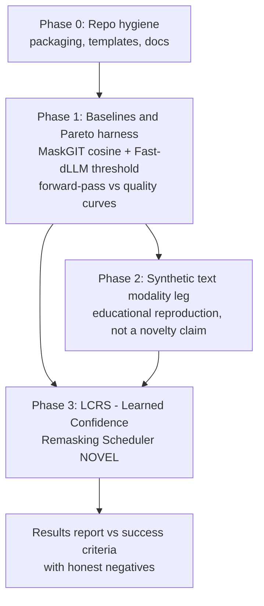

# Roadmap

This roadmap turns the repository from a clean educational implementation of
DiDA [1] into a contribution-ready research codebase with one **novel research
direction**: the **LCRS — Learned Confidence Remasking Scheduler** (Phase 3).
Each phase lists goals, deliverables, and exit criteria. The live task board
is in `docs/PROJECT.md`; open design choices are in `docs/METHODS.md`.

## Phase 0 — Repo hygiene (complete or near-complete)

- Documentation set: `INTRODUCTION.md`, `EXTENDED_INTRODUCTION.md`,
  `METHODS.md`, `ROADMAP.md`, `PROJECT.md`.
- `CONTRIBUTING.md`, issue and PR templates, in-repo project board.
- Packaging cleanup (`pyproject.toml`) and pytest configuration.
- API reference for the public classes.

**Exit criteria:** a newcomer can install, test, and find a first issue
without reading the source.

## Phase 1 — Stronger baselines + speed/quality Pareto harness

The DiDA claim is fundamentally a *trade*: quality vs number of forward
passes [1]. Before learning anything, we need honest heuristic baselines and a
reproducible way to measure the trade.

**Deliverables**
1. MaskGIT cosine-schedule sampler [4] and Fast-dLLM confidence-threshold
   sampler [11], both behind one scheduler API.
2. Benchmark harness: fixed seeds, grid of step budgets, quality metric per
   `docs/METHODS.md` §4.2, output as Pareto curves (quality vs forward-pass
   count).
3. Pre-registered comparison report of the two baselines.

**Exit criteria:** Pareto curves for both baselines are reproducible from a
single command, with seeds and metrics fixed *before* results are examined.

## Phase 2 — Modality-general adaptation study (educational reproduction)

Does the DiDA adaptation machinery transfer beyond image tokens? We add a
**synthetic text leg** — tasks with strong position dependencies such as
arithmetic carries and bracket matching — and apply the same hybrid-mask
adaptation.

> **Honest scope note:** DiDA-style adaptation for text **already exists** in
> the literature — DiffuLLaMA [10], Dream 7B [9], and Dream-Coder 7B [14].
> This phase is an **educational reproduction** of that idea on synthetic
> tasks, and a substrate for Phase 3's cross-modal experiments. It is **not**
> a novelty claim.

**Deliverables**
1. Synthetic text task suite + data generators (arithmetic carries, bracket
   matching), with ground-truth answers for exact-match scoring.
2. Text-leg hybrid masks (bidirectional noisy / causal clean) and an
   adaptation smoke test against a causal AR baseline; masks unit-tested
   against a reference causal run to catch silent quality degradation.
3. Per-modality adaptation quality report.

**Exit criteria:** text-leg quality at parity with the causal AR baseline
within noise (success criterion 4 below), documented either way.

## Phase 3 — NOVEL RESEARCH: LCRS (Learned Confidence Remasking Scheduler)

### The gap

Every published masked-diffusion sampler decides *what to unmask when* with a
**hand-written heuristic**: MaskGIT's fixed confidence curve [4], Fast-dLLM's
fixed confidence threshold [11], ReMDM's fixed remasking schedules [12],
Dream's heuristic rescheduling [9]. Learned approaches exist only as RL
bolt-ons (MDPO [16]) or order-planning studies [17, 18] — **none trains a
small standalone scheduler that maps per-position confidence dynamics to
unmask/stop decisions, meta-learned across synthetic tasks.** That is the
unclaimed niche LCRS targets. The contribution is the **scheduler**, not
modality generality.

### The idea

Train a small policy network that observes, at each denoising step, the
current confidences (and their history), plus position and modality
embeddings, and outputs (a) which positions to unmask and (b) a predicted
remaining step budget, enabling **per-sample adaptive stopping**: easy samples
finish in few passes, hard samples get more. Training is **distillation from
oracle trajectories** — near-optimal unmask orders found by greedy per-step
search on synthetic tasks — not RL (see `docs/METHODS.md` §4.3).

### Experiment plan (single GPU, synthetic)

1. **Oracle generator.** Greedy per-step search for unmask orders that
   maximize exact-match quality per forward pass, on tasks with strong
   position dependencies (arithmetic carries, bracket matching, structured
   image grids).
2. **LCRS policy module.** Small transformer over confidence dynamics +
   position/modality embeddings; distillation training; unit tests.
3. **Step-budget head.** Predict per-sample remaining steps; adaptive
   stopping.
4. **Evaluation.** Pareto comparison vs Phase 1 baselines; correlation
   between sample difficulty and allocated steps; ablations of scheduler
   inputs (current confidence vs confidence history vs +position/modality
   embeddings).
5. **Cross-modal transfer.** Train the scheduler on the text leg, apply to
   image tokens, and vice versa.
6. **Results report** against the success criteria below, including honest
   negatives.

### Risks

- **Collapse to Fast-dLLM behavior:** the learned scheduler may simply
  rediscover a confidence threshold, adding complexity with no gain. Phase 1
  baselines exist to detect this; if LCRS cannot beat them on the Pareto
  frontier, we report that honestly.
- **Oracle orders may not beat heuristics on unstructured data:** mitigation
  is task choice — only tasks with strong position dependencies give oracles
  room to win.
- **Overfitting the mask-ratio distribution:** mitigate with held-out schedule
  shapes and cross-modal transfer tests.
- **Silent hybrid-mask bugs:** masks unit-tested against reference causal runs
  in every phase.

### Success criteria

1. **Pareto:** at equal forward-pass count, beat a baseline's quality by ≥5%
   on synthetic exact-match; **or** equal quality at ≥1.5× fewer passes.
2. **Step adaptivity:** Spearman ρ > 0.5 between oracle difficulty and
   allocated steps.
3. **Cross-modal transfer:** transfer retains ≥90% of the within-modality
   advantage.
4. **Text-leg parity:** quality within noise of the causal AR baseline.

Failure on any criterion is reported as a negative result, not hidden —
pre-registered metrics make the negatives informative.

## References

1. Cui, Y., Chen, H., Deng, H., et al. (BAAI), 2025. *Emu3.5: Native Multimodal Models are World Learners*. arXiv:2510.26583.
4. Chang, H., et al., CVPR 2022. *MaskGIT: Masked Generative Image Transformer*. arXiv:2202.04200.
9. Ye, J., et al., 2025. *Dream 7B*. arXiv:2508.15487.
10. Gong, S., et al., 2024. *Scaling Diffusion Language Models via Adaptation from Autoregressive Models* (DiffuLLaMA). arXiv:2410.17891.
11. Wu, C., et al., 2025. *Fast-dLLM: Training-free Acceleration of Diffusion LLM by Enabling KV Cache and Parallel Decoding*. arXiv:2505.22618.
12. Wang, J., Schiff, Y., Sahoo, S., Kuleshov, V., 2025. *Remasking Discrete Diffusion Models with Inference-Time Scaling* (ReMDM). arXiv:2503.00307.
14. Dream-Coder 7B, 2025. arXiv:2509.01142.
16. MDPO, 2025. arXiv:2508.13148.
17. *Path Planning for Masked Diffusion Sampling*, 2025. arXiv:2502.03540.
18. *Think While You Generate*, 2024. arXiv:2410.06264.
