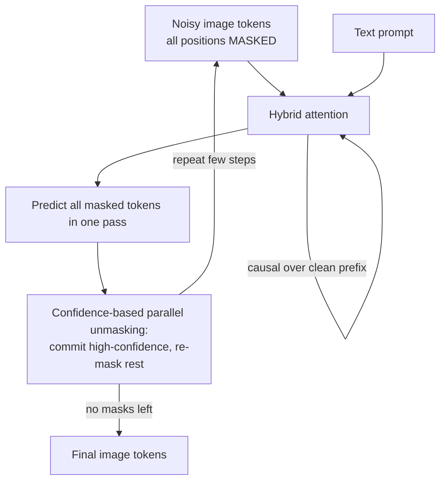

# Concept Figure

The canonical concept figure for this repository is
[`concept_figure.svg`](concept_figure.svg) — a flat-design, NeurIPS/FigForge-style
diagram (white background, pastel modules, thin strokes) showing DiDA decoding — masked image tokens, hybrid attention (bidirectional noisy / causal clean), confidence-based parallel unmasking, final image tokens.
It is embedded near the top of [../INTRODUCTION.md](../INTRODUCTION.md) and
[../EXTENDED_INTRODUCTION.md](../EXTENDED_INTRODUCTION.md).

> Note: an AI-generated PNG rendering of the same figure (1536x1024) also
> exists but is kept out of git (binary assets are not committed via the
> project tooling). The SVG above is the source of truth.

If your viewer cannot render SVG, here is a faithful Mermaid sketch of the
same structure:

